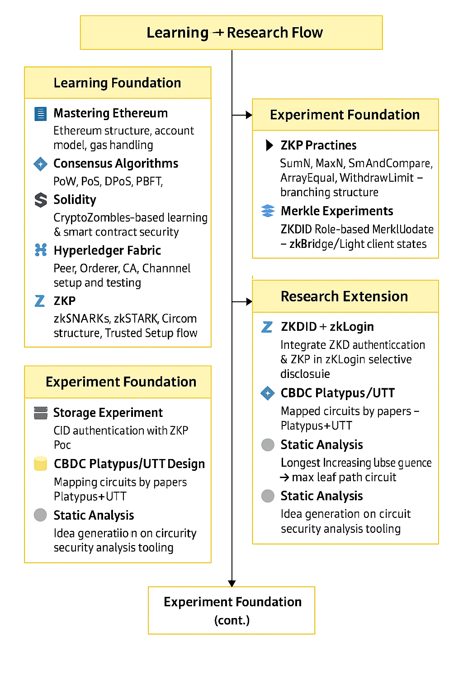

# 🌍 About Me

# 👋 Hi, I'm Junseung Lee

🎓 Cybersecurity Undergraduate @ Ajou University  
🔐 Researching ZKP, Blockchain Architecture, Secure Identity  
🚀 PET Lab Applicant | 🛠 Circom Practice | 🌐 zkDID + zkBridge | 💡 CBDC Protocols  
🧠 Building: Systems that protect people, invisibly.

Originally trained in Media & Communication, I now build **secure-by-design architectures** that embed privacy and trust directly into protocol design.

> I pursue **technologies that protect people invisibly** — through zero-knowledge proofs, secure cloud systems, and real-world decentralization.

---

## 📌 Core Research Values

- 🛡 **Security as Trust Infrastructure**: Safety must be verifiable, not assumed.
- 🙋 **People-Centered Design**: Tech must empower and respect its users.
- 🧪 **Prototype-Driven Thinking**: Real-world deployment over theoretical elegance.
- 🔁 **Verifiability & Transparency**: All systems should be auditable and explainable.

## 🔬 Research Domains

| Area                          | What I Study                            | Tools/Tech                 |
| ----------------------------- | --------------------------------------- | -------------------------- |
| 🔗 Blockchain Arch.           | ZKP-based auth, smart contract security | Solidity, Fabric, zkSNARKs |
| 🧩 ZKPs                       | Groth16, Circom, zkBridge               | Circom, snarkjs, Zokrates  |
| 🧠 Algorithm & Learning       | DP, LIS, tree traversal, crypto proofs  | Python, BOJ                |
| 📦 IPFS/Decentralized Storage | Content addressing, verifiable storage  | IPFS, hash tree            |
| ☁️ Cloud Security             | Zero Trust infra, cloud-native design   | AWS, Barksa, IAM           |

My long-term goal is to become a **researcher who builds real-world systems that protect people**, not just in theory but through transparent, verifiable, and robust architecture.

---

## 📂 Featured Projects

| Title                                                                                                                             | Description                                                                                                                   | Stack                              |
| --------------------------------------------------------------------------------------------------------------------------------- | ----------------------------------------------------------------------------------------------------------------------------- | ---------------------------------- |
| [🚚 Hyperledger Fabric Delivery Contract](https://github.com/junseng12/Hyperledger-Fabric-based-delivery-platform-smart-contract) | Built a full-stack blockchain delivery platform using Fabric. Includes PM planning, CLI tests, and smart contract validation. | Fabric, Node.js, CLI, Bash         |
| [🔐 ZKDID Role-Based Auth](https://github.com/junseng12/Zero-Knowledge-Proof/tree/main/04-Role-Based-ZKDID)                       | Verify whether a user is on the allowed identity list using zkSNARK-based proof. Integrates `isAuthorized` logic in Solidity. | Circom, snarkjs, Solidity, Hardhat |
| [🌳 Merkle Tree Proof + Update](https://github.com/junseng12/Zero-Knowledge-Proof/tree/main/03-MerkleProof)                       | Practice for leaf path verification and tree state update logic. Precursor to zkBridge state sync.                            | Circom 2.0, merkle.circom, snarkjs |
| [📘 Platypus + UTT Protocol Review](https://github.com/junseng12/Blockchain_Paper_Reviews/tree/main/Platypus-UTT-Review)          | In-depth academic summary and review of privacy-preserving offline CBDC payment protocols.                                    | Markdown, concept_questions.md     |
| [📦 IPFS + ZKP Hybrid Experiment](https://github.com/junseng12/Zero-Knowledge-Proof)                                              | Design and PoC of verifiable decentralized storage with file fingerprint proof and IPFS CID hash checks.                      | IPFS, Circom, Solidity (planned)   |
| [🧠 Algorithm Study Plan](https://github.com/junseng12/Algorithm-Study)                                                           | Neuroscience-based DP, tree DP, LIS, and advanced dynamic state training for ZKP algorithmic prep.                            | Python, markdown reflections       |

📌 More to Come:

- \[zkBridge State Sync Verification (TBD)] – Using Merkle root comparison + zk circuit generation
- \[ZK-based CBDC Offline Prototype (TBD)] – Experimental platform after Platypus review

---

## 📚 Learning & Research Flow

---

<h2>📊 Development Stats</h2>

  

     
    
  

  
  

    
  

---

## 🧰 Tech Stack

### 🧪 Currently Practicing

### 🛠️ Used in Projects

### 🧰 Developer Tools

---

## 🚀 Next Steps

| Priority     | Area           | Task                                                          | Notes                                                           |
| ------------ | -------------- | ------------------------------------------------------------- | --------------------------------------------------------------- |
| 🔥 High      | zkSNARK Infra  | Complete Circom → zkey → Solidity → Hardhat → Verifier test   | Automate full ZKP flow w/ robust testing (unit + integration)   |
| 🔐 High      | ZKDID+RBAC     | Finalize ZKDID with dynamic role check via input hash logic   | Extend isAuthorized logic + preimage circuit                    |
| 🧪 High      | zkBridge       | Implement root comparison & update flow in Circom             | MerkleProof + MerkleUpdate 기반 state sync logic                |
| 📦 Medium    | IPFS-ZK Verify | Prototype CID integrity zkVerifier (Filecoin-inspired)        | Experiment with zkCID, hash checks, and IPFS file access proofs |
| 🧠 Medium    | Crypto-DP      | Transform Tree DP or LIS into verifiable circuit design       | Focus: Merkle max path, LIS validation via comparator circuits  |
| 📘 Ongoing   | Paper Systems  | Visualize Platypus/UTT into architecture diagrams             | Build `/docs/`, diagram + summary files for each protocol       |
| 🔍 Research  | zkCompare      | Comparative study: zkSNARK vs zk-STARK on similar circuits    | Focus on proof size, time, verifier gas, privacy guarantees     |
| 🧪 Design    | zkAudit Tool   | Build Circom-based analyzer: public signal leak + misuse scan | Begin open-source static analyzer for circuit security          |
| 🧠 Expansion | zkDID Login    | Design zero-knowledge zkLogin DID Auth prototype              | Based on selective disclosure → create partial profile model    |
| 🏛️ Goal      | Thesis         | Consolidate into 1 publishable ZK-based PoC paper             | Target: PET Lab presentation + repo-public research manuscript  |

---

## 📬 Contact

- **Email:** junseng12@gmail.com
- **Notion Portfolio:** _(preparing)_
- **GitHub:** [@junseng12](https://github.com/junseng12)

---
